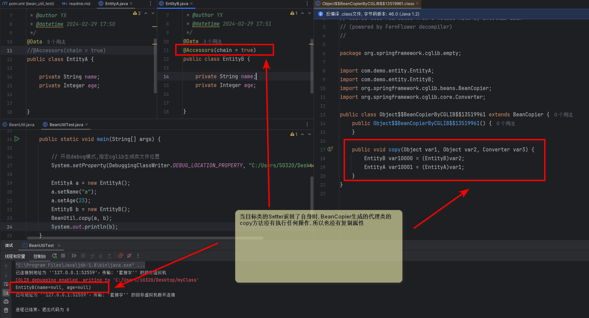
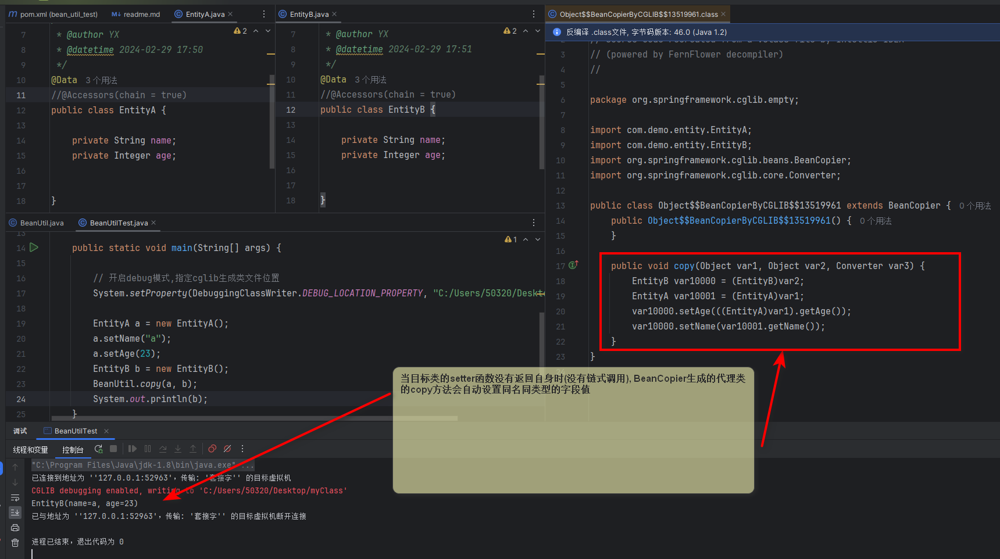

##### 一行代码引发的山崩海啸

> 今天用户反馈某个功能出现异常, 发现原因出在一个BeanUtil拷贝属性无效, 而以前没发现这个问题,工具类代码如下

~~~java

import org.springframework.cglib.beans.BeanCopier;

public class BeanUtil {

    /**
     * 使用BeanCopier进行拷贝
     */
    public static void copy(Object source, Object target) {
        BeanCopier copier = BeanCopier.create(source.getClass(), target.getClass(), false);
        copier.copy(source, target, null);
    }

}

~~~

> 令人诧异的是这个工具类已经被很多方法引用了,难到这么多地方都无法复制属性却都没发现问题? 最开始还以为是spring版本的问题,
> 然后重新创建了一个简单工程,测试了这个代码发现并没有什么问题,
> 后面采取控制变量法,发现问题在于当使用了lombok的链式注解@Accessors(chain=true)时,无法复制属性, 于是我开启了cglib的代理类debug模式,
> 将生成的代理类输出到文件,发现如果target(目标对象)的set方法return了自身(链式调用), 则BeanCopier生成的代理类没有做任何操作

**如图所示**

> 当目标对象的setter函数存在return this时,无法复制属性值



> 当目标对象没有在setter中返回自身则可以复制


值得注意的是这并不是lombok的锅, lombok只是生成了链式的set方法,方便我们链式调用,所以假如你自己手写链式调用也是不行的
例如下面这个类作为target参数的时候也无法复制属性

```java
public class EntityB {

    private String name;
    private Integer age;

    public String getName() {
        return name;
    }
    public Integer getAge() {
        return age;
    }
    /**
     * setter返回自身,方便链式调用
     *
     * @param name
     * @return
     */
    public EntityB setName(String name) {
        this.name = name;
        return this;
    }

    /**
     * setter返回自身,方便链式调用
     *
     * @param age
     * @return
     */
    public EntityB setAge(Integer age) {
        this.age = age;
        return this;
    }
}

```

> 所以只是BeanCopier在对象存在链式setter这种情况下不适用,所以还是用spring的BeanUtils.copyProperties比较简单透明,没这么多的黑魔法...

------------------------------------------------

**2024年3月7日补充**
>今天发现apache-commons包的BeanUtils.copyProperties也无法复制字段的setter函数有返回值的对象, 另外本身apache-commons的复制方法性能也不如spring的,在此建议统一使用spring包的BeanUtils.copyProperties
> 